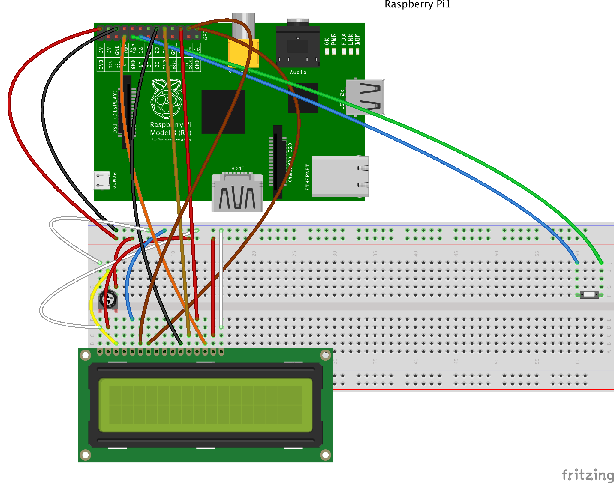
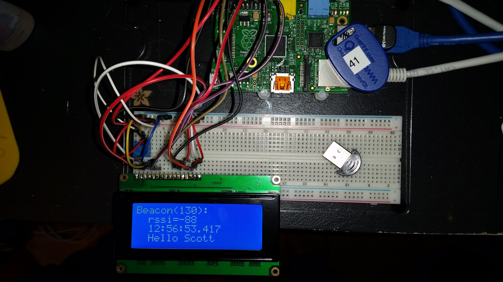
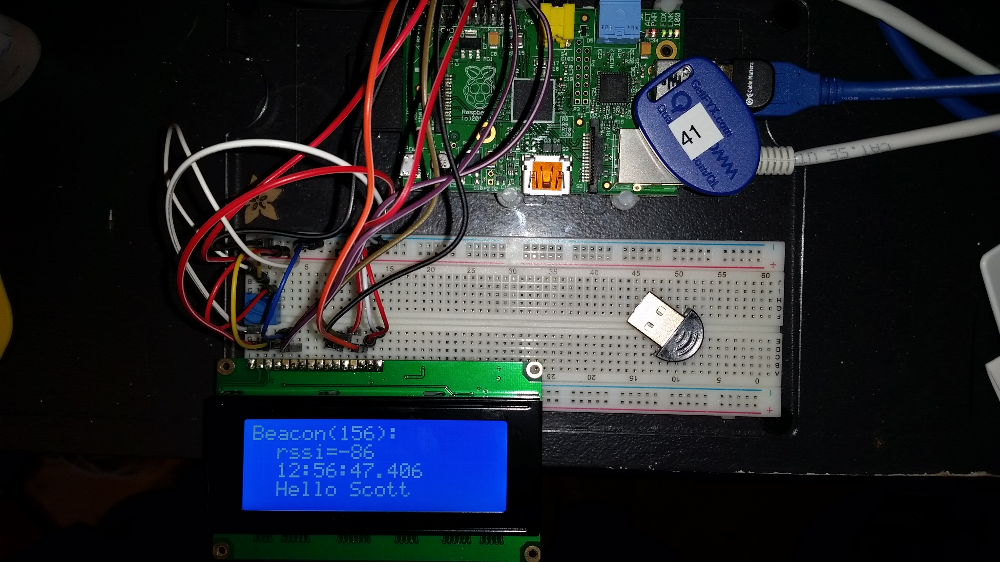
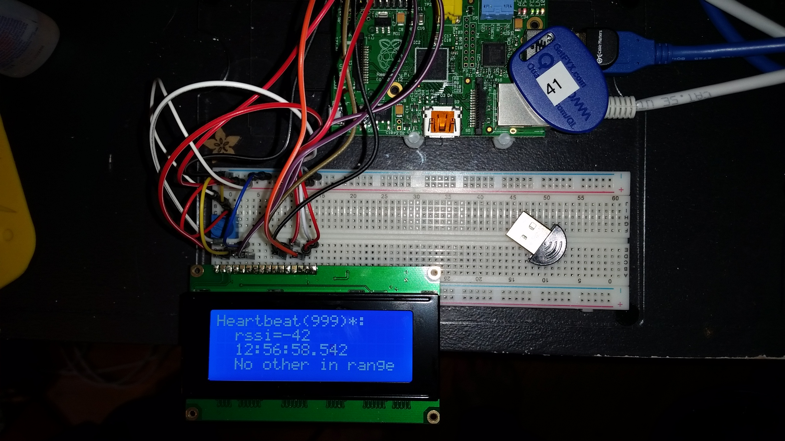
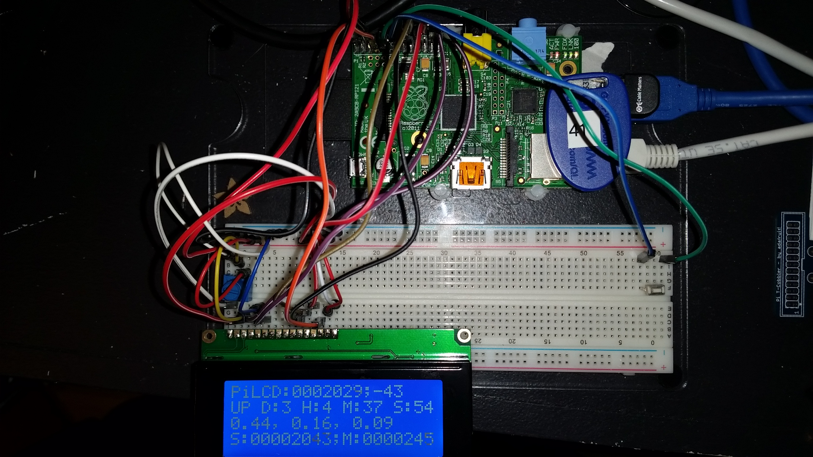

e# NativeRaspberryPiBeaconParser
This is the native code version of the RaspberryPiBeaconParser. 
The Java version of this repository is located at: [RaspberryPiBeaconParser](https://github.com/starksm64/RaspberryPiBeaconParser), and it contains the Java org.jboss.summit2015.beacon.Beacon code for handling the creation/parsing of the MQTT binary messages produced by the NativeRaspberryPiBeaconParser.

# The iBeacon format seen in hcidump -R
TODO

# The Beacon wire format published to MQTT
The

# Creating the RaspberryPiBeaconParser pidora image
A custom pidora image needs to be created in order to be able to build the required software apis. A prebuilt custom image is available from here: [TBD]()

The preconfigured logins are:

	pi
	raspberry
	
	root
	root0FPi

Otherwsie, you can build your own image by starting with the
[Pidora-2014-R3](http://downloads.raspberrypi.org/pidora_latest) Fedora remix. See the following page for information on how to burn the image to a SD card:
[RPi_Easy_SD_Card_Setup](http://elinux.org/RPi_Easy_SD_Card_Setup)

## Customizing the base Pidora-2014-R3 image
Perform the following instalations and downloads to enable access to the development tools and code needed to build the native scanner.

	yum install net-tools
	yum install glib2-devel dbus-glib-devel gcc-c++ git

### BlueZ
	wget http://www.kernel.org/pub/linux/bluetooth/bluez-5.28.tar.xz
	tar -xJf bluez-5.28.tar.xz
	yum install libudev-devel
	yum install libical-devel readline-devel
	yum install cmake dbus-devel
	cd bluez-5.28
	./configure
	make
	make install

### Paho mqtt client
	yum install openssl-devel
	git clone https://github.com/eclipse/paho.mqtt.c.git
	cd paho.mqtt.c
	make
	make install

### activemq CMS client library
	wget http://www.apache.org/dyn/closer.cgi/activemq/activemq-cpp/3.8.3/activemq-cpp-library-3.8.3-src.tar.gz
	yum install apr-devel
	yum install cppunit cppunit-devel
	./configure
	make
	make install
	
### Qpid proton client
 git clone https://git-wip-us.apache.org/repos/asf/qpid-proton.git
 yum install libuuid-devel java-1.8.0-openjdk-devel
 mkdir build
 cd build
 cmake .. -DCMAKE_INSTALL_PREFIX=/opt/local
 make
 make install
 
### Qpid cpp client
	yum install ruby
 git clone git://git.apache.org/qpid.git
 cd qpid/qpid/cpp
 mkdir build
 cd build
 cmake .. -DCMAKE_INSTALL_PREFIX=/opt/local
 make
 make install

### NativeRaspberryPiBeaconParser
	git clone https://github.com/starksm64/NativeRaspberryPiBeaconParser.git
	cd NativeRaspberryPiBeaconParser

The next section describes the various targets that can be built from the NativeRaspberryPiBeaconParser tree.

# Building the code on pidora
The pidora image has a NativeRaspberryPiBeaconParser under root that contains the native scanner code. You can clone
this repository from:
git clone https://github.com/starksm64/NativeRaspberryPiBeaconParser.git

## Making a debug build
	mkdir Debug
	cd Debug
	cmake -DCMAKE_BUILD_TYPE=Debug ..
	cd ..
	cmake --build Debug --target NativeScanner
	cmake --build Debug --target NativeScannerBlueZ
	
## Making a debug build with print statement enabled
	mkdir Debug
	cd Debug
	cmake -DPRINT_DEBUG=ON -DCMAKE_BUILD_TYPE=Debug ..
	cd ..
	cmake --build Debug --target NativeScannerBlueZ

## Making a debug build with extra printing enabled
	mkdir Debug
	cd Debug
	cmake -DPRINT_DEBUG=ON -DCMAKE_BUILD_TYPE=Debug ..
	cd ..
	cmake --build Debug --target NativeScannerBlueZ

## Making a release build
	mkdir Release
	cd Release
	cmake -DCMAKE_BUILD_TYPE=Release ..
	cd ..
	cmake --build Release --target NativeScanner
	cmake --build Release --target NativeScannerBlueZ

## Putting the bluetooth interface into scan mode
	hciconfig hci0 up
	hcitool lescan --duplicates 1>/dev/null &
	hcidump -R >/tmp/hcidump.raw
	[root@pidora-development-scanner NativeRaspberryPiBeaconParser]# hciconfig
	hci0:	Type: BR/EDR  Bus: USB
		BD Address: 5C:F3:70:64:08:BC  ACL MTU: 1021:8  SCO MTU: 64:1
		UP RUNNING 
		RX bytes:42502 acl:0 sco:0 events:1108 errors:0
		TX bytes:783 acl:0 sco:0 commands:56 errors:0

## Running an MQTT server
[~ 502]$ /usr/local/sbin/mosquitto -c /usr/local/etc/mosquitto/mosquitto.conf
1421732379: mosquitto version 1.3.5 (build date 2014-10-27 15:13:47+0000) starting
1421732379: Config loaded from /usr/local/etc/mosquitto/mosquitto.conf.
1421732379: Opening ipv4 listen socket on port 1883.
1421732379: Opening ipv6 listen socket on port 1883.

## Testing the scanner
Test parsing a stored hcidump file without publishing the messages:
[root@pidora-development-scanner NativeRaspberryPiBeaconParser]# Release/src/NativeScanner --scannerID test1 --skipPublish --rawDumpFile /tmp/hcidump.raw 

Test parsing a stored hcidump file and publish the messages:
Release/src/NativeScanner --scannerID test1 --brokerURL "tcp://192.168.1.107:1883" --rawDumpFile /tmp/hcidump.raw

## Running the scanner
Below are example command lines for running the scanner. It is assumed that previously one has put the bluetooth interface into [ScanMode](#ScanMode) on the scanner host in order for the events to be available. Note that the scanner must be run either as root, or run using sudo to allow the scanner to read the events from the hci interface.

### Full list of command line options
The full list of command line options that the native scanner supports are:

	USAGE: 
    
       ./NativeRaspberryPiBeaconParser/Debug/src2/NativeScannerBlueZ  [-Z] [-K]
                                            [-Q] [-A] [-S] [-B <int>] [-C
                                            <int>] [-P
                                            <MsgPublisherTypeConstraint>] [-D
                                            <string>] [-W <int>] [-t <string>]
                                            [-b <string>] [-p <string>] [-u
                                            <string>] [-c <string>] [-d
                                            <string>] [-H <string>] -s <string>
                                            [--] [--version] [-h]
    
    
    Where: 
    
       -Z,  --analzyeMode
         Run the scanner in a mode that simply collects beacon readings and
         reports unique beacons seen in a time window
    
       -K,  --skipHeartbeat
         Don't publish the heartbeat messages. Useful to limit the noise when
         testing the scanner.
    
       -Q,  --useQueues
         Indicate that the destination type is a queue. If not given the
         default type is a topic.
    
       -A,  --asyncMode
         Indicate that the parsed beacons should be published using async
         delivery mode
    
       -S,  --skipPublish
         Indicate that the parsed beacons should not be published
    
       -B <int>,  --batchCount <int>
         Specify a maxium number of events the scanner should combine before
         sending to broker; default 0 means no batching
    
       -C <int>,  --maxCount <int>
         Specify a maxium number of events the scanner should process before
         exiting; default 0 means no limit
    
       -P <MsgPublisherTypeConstraint>,  --pubType <MsgPublisherTypeConstraint>
         Specify the MsgPublisherType enum for the publisher implementation to
         use; default AMQP_QPID
    
       -D <string>,  --hciDev <string>
         Specify the name of the host controller interface to use; default hci0
    
       -W <int>,  --analyzeWindow <int>
         Specify the number of seconds in the analyzeMode time window
    
       -t <string>,  --destinationName <string>
         Specify the name of the queue on the MQTT broker to publish to;
         default beaconEvents
    
       -b <string>,  --brokerURL <string>
         Specify the brokerURL to connect to the MQTT broker with; default
         tcp://localhost:1883
    
       -p <string>,  --password <string>
         Specify the password to connect to the MQTT broker with
    
       -u <string>,  --username <string>
         Specify the username to connect to the MQTT broker with
    
       -c <string>,  --clientID <string>
         Specify the clientID to connect to the MQTT broker with
    
       -d <string>,  --rawDumpFile <string>
         Specify a path to an hcidump file to parse for testing
    
       -H <string>,  --heartbeatUUID <string>
         Specify the UUID of the beacon used to signal the scanner heartbeat
         event
    
       -s <string>,  --scannerID <string>
         (required)  Specify the ID of the scanner reading the beacon events
    
       --,  --ignore_rest
         Ignores the rest of the labeled arguments following this flag.
    
       --version
         Displays version information and exits.
    
       -h,  --help
         Displays usage information and exits.

### Run the scanner using the text output from hcidump as input
This consumes the hcidump command output as the input for the beacon events, and publishes the beacon event messages to the MQTT server running at address tcp://192.168.1.107:1883.
	
	hcidump -R | Release/src/NativeScanner --scannerID ProdScanner1 --brokerURL "tcp://192.168.1.107:1883"
	
### Run the scanner using the text file from a saved hcidump as input
This consumes the hcidump output that has been saved to a file as the input for the beacon events, and publishes the beacon event messages to the MQTT server running at address tcp://192.168.1.107:1883.
	
	Debug/src/NativeScanner --scannerID ProdScanner1 --rawDumpFile tests/hcidumpBig.raw --brokerURL "tcp://192.168.1.107:1883"
	
### Running the bluez native scanner using hci1
This command takes the beacon events coming from the hci1 bluetooth interface and publishes them to the MQTT server running at address tcp://192.168.1.107:1883.  

	Debug/src2/NativeScannerBlueZ --scannerID NativeScannerBlueZ --hciDev hci1 --brokerURL "tcp://192.168.1.107:1883"

### Running the bluez native scanner using hci0 without publishing events to broker
This command takes the beacon events coming from the default hci0 bluetooth interface and simply prints them out to the console for debugging.  

	Debug/src2/NativeScannerBlueZ --scannerID NativeScannerBlueZ --skipPublish
	Debug/src2/NativeScannerBlueZ --scannerID NativeScannerBlueZ --skipPublish --heartbeatUUID DAF246CEF20111E4B116123B93F75CBA
		
### Running the bluez native scanner using hci1 and async message publishing
This command takes the beacon events coming from the hci1 bluetooth interface and publishes them to the MQTT server running at address tcp://192.168.1.107:1883 using asynchronous delivery.

	NativeScannerBlueZ --scannerID NativeScannerBlueZ --hciDev hci1 --brokerURL "tcp://192.168.1.107:1883" --asyncMode
	
### Running the bluez native scanner using hci0 and the AMQP QPID msg publisher using default topic destination type and default "beaconEvents" name

NativeScannerBlueZ --scannerID NativeScannerBlueZ --pubType AMQP_QPID --brokerURL "192.168.1.107:5672"

### Running the bluez native scanner using hci0 and the AMQP QPID msg publisher using a queue type destination with default "beaconEvents" name

	Debug/src2/NativeScannerBlueZ --scannerID NativeScannerBlueZ --pubType AMQP_QPID --brokerURL "192.168.1.107:5672" --useQueues

## Systemd Startup
There are systemd services, scanner-configd.service and scannerd.service, that automate the startup of the scanner configuration service that pulls down a scanner node's beacon configuration file, and runs the NativeScannerBlueZ. The systemd configuration files are:

* /usr/lib/systemd/system/scanner-configd.service
	
	[Unit]
	Description=Configuration daemon to pull down the scanner configuration on startup
	After=network-online.target
	
	[Service]
	Environment="JAVA_HOME=/root/jdk1.8.0_33"
	ExecStart=@/usr/local/bin/scanner-configd scanner-configd
	TimeoutStartSec=30
	Type=oneshot
	
	[Install]
	WantedBy=scanner-config.service

* /usr/lib/systemd/system/scannerd.service

	[Unit]
	Description=Serivce config file for the beacon scanner
	Wants=scanner-configd.service
	After=network-online.target
	
	[Service]
	Environment="JAVA_HOME=/root/jdk1.8.0_33"
	ExecStart=/root/NativeRaspberryPiBeaconParser/bin/run-scanner.sh -background
	Type=forking
	
	[Install]
	WantedBy=multi-user.target

#### Enable the scannerd.service:
	[root@pi-room202 NativeRaspberryPiBeaconParser]# systemctl enable scannerd.service
	ln -s '/usr/lib/systemd/system/scannerd.service' '/etc/systemd/system/multi-user.target.wants/scannerd.service'

#### Reload the scannerd.service configuration after a change
	[root@pi-room202 NativeRaspberryPiBeaconParser]# systemctl daemon-reload

#### Use the sytemctl command to check the service status, restart, etc.

	[root@pi2-room201 ~]# systemctl status scannerd.service
	scannerd.service - Serivce config file for the beacon scanner
	   Loaded: loaded (/usr/lib/systemd/system/scannerd.service; enabled)
	   Active: active (running) since Thu 1970-01-01 00:00:37 PST; 45 years 3 months ago
	  Process: 1067 ExecStart=/root/NativeRaspberryPiBeaconParser/bin/run-scanner.sh -background (code=exited, status=0/SUCCESS)
	   CGroup: /system.slice/scannerd.service
	           ├─1075 hcitool lescan --duplicates
	           └─1076 /root/NativeRaspberryPiBeaconParser/Debug/src2/NativeScanne...
	
	Jan 01 00:00:37 pi2-room201 systemd[1]: Starting Serivce config file for the....
	Jan 01 00:00:37 pi2-room201 run-scanner.sh[1067]: Running: /root/NativeRaspbe...
	Jan 01 00:00:37 pi2-room201 systemd[1]: Started Serivce config file for the ....
	Hint: Some lines were ellipsized, use -l to show in full.
	
# LCD Display
The beacon scanner code supports display of information about the closest beacon to the scanner as well a brief summary of status information via an attached lcd screen. An example of wiring up a RaspberryPi Model B to an LCD display is show in this image:

The scanner has two different display modes; closest beacon and a status summary. The current display mode can be toggled by wiring up and then pressing the momentary button as shown in the preceeding illustration.

## Closest Beacon Display
The scanner will display the closest in its default display mode. If there are no beacons in range of the scanner, it will display the heartbeat beacon associated with the scanner. The following images show switching between beacons 130 and 156, and then finally displaying the scanner heartbeat beacon 999 when no other beacons are within range.

## Status Display
Clicking the mode button switches the scanner display mode to status display. In this mode the scanner displays:

* ScannerName: HeartbeatBeacon count; HeartbeatBeaconRSSI
* UP Days:DD Hours:HH Minutes:MM Seconds:SS
* Load average over 1, 5 and 15 minutes
* ScannerEvents:NNNNNNNN;MsgPublishedToBroker:NNNNNNNN

An example status view is shown in this picture:

